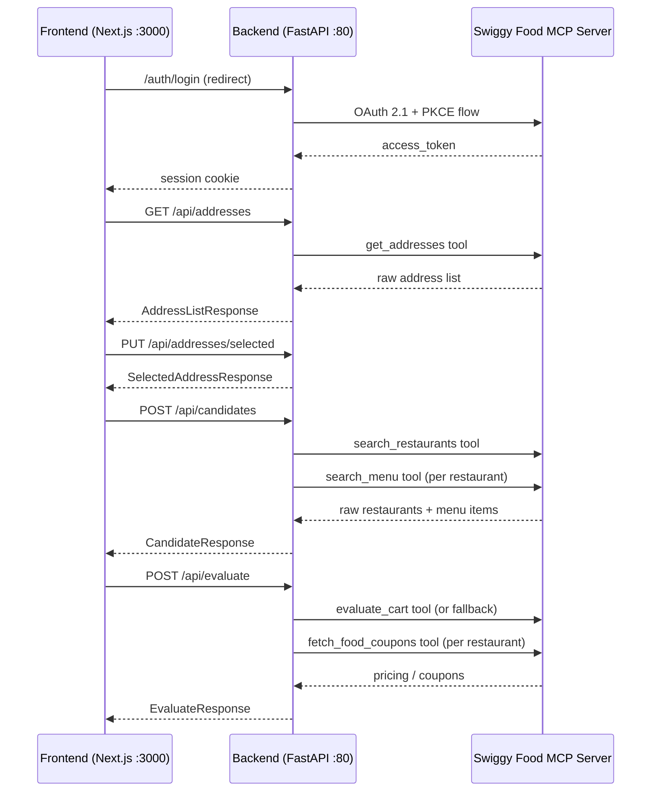

# SwiggyOpt API Endpoints — Complete Reference

This document explains every API endpoint in the SwiggyOpt backend, the data each receives from Swiggy's MCP server, and how it flows through to the frontend.

---

## Architecture Overview



---

## 1. Authentication Flow

### `GET /auth/login` → Redirect to Swiggy

Initiates the OAuth 2.1 Authorization Code + PKCE flow:
1. Registers a public client via Swiggy's DCR endpoint (`POST /auth/register`)
2. Generates a PKCE `code_verifier` + `code_challenge` (S256)
3. Redirects the browser to `https://mcp.swiggy.com/auth/authorize?...`
4. User completes phone/OTP on Swiggy's site

### `GET /callback?code=...&state=...` → Redirect to Frontend

Swiggy redirects back here after user consent:
1. Validates the `state` nonce against the session
2. Exchanges the authorization `code` + `code_verifier` for an `access_token` (`POST /auth/token`)
3. Stores the token server-side in an `AuthenticatedSession` (never in cookies)
4. Redirects to `http://localhost:3000` (the frontend)

### `GET /api/auth/status`

**Response:** `AuthStatusResponse`
```json
{ "authenticated": true }
```
Lightweight check — the frontend polls this to know if the user is logged in.

---

## 2. Address Management

### `GET /api/addresses`

**Swiggy MCP Tool Called:** `get_addresses`

**Raw data received from Swiggy:**
```json
{
  "addresses": [
    {
      "id": "123456",
      "addressLine": "Flat 4B, Tower 2, ...",
      "phoneNumber": "98XXXXXXXX",
      "addressCategory": "home",
      "addressTag": "Home"
    }
  ]
}
```

**Response:** `AddressListResponse`
```json
{
  "addresses": [
    {
      "id": "123456",
      "address_line": "Flat 4B, Tower 2, ...",
      "phone_number": "98XXXXXXXX",
      "address_category": "home",
      "address_tag": "Home"
    }
  ]
}
```

### `PUT /api/addresses/selected`

**Request Body:** `SelectAddressRequest`
```json
{ "address_id": "123456" }
```

**Response:** `SelectedAddressResponse`
```json
{ "address_id": "123456" }
```
Stores the selected address in server-side session memory.

---

## 3. Menu Discovery

### `GET /api/restaurants/{restaurant_id}/menu`

**Query params:** `page`, `page_size`, `q` (optional dish search), `offset`

**Swiggy MCP Tools Called:**
- `get_restaurant_menu` — paginated category listing
- `search_menu` — (only if `q` is provided) scoped customization search

**Raw data received from Swiggy (`get_restaurant_menu`):**
```json
{
  "restaurant": {
    "id": "12345",
    "name": "BOX8 - Desi Meals",
    "areaName": "Pragati Nagar",
    "cuisines": ["North Indian", "Biryani"],
    "avgRating": 4.3,
    "isOpen": true,
    "deliveryTime": 35
  },
  "categories": [
    {
      "title": "Recommended",
      "categoryId": "cat1",
      "items": [
        {
          "id": "item123",
          "name": "Aloo Matar Veg Thali",
          "defaultPrice": 29900,
          "finalPrice": 21900,
          "isVeg": 1,
          "inStock": 1,
          "hasVariants": true,
          "variantsV2": [ ... ],
          "addons": [ ... ]
        }
      ]
    }
  ],
  "page": 1,
  "pageSize": 5,
  "totalCategories": 12,
  "hasMore": true
}
```

> [!IMPORTANT]
> Prices from Swiggy come in **paise** (₹299 = `29900`, ₹219 = `21900`). The `extract_price_in_rupees()` function converts them to INR. It also prioritizes `finalPrice`/`offerPrice` over `defaultPrice`/`price` to show the actual discounted price.

**Response:** `MenuResponse` with normalized prices in rupees.

---

## 4. Offer/Coupon Discovery

### `GET /api/restaurants/{restaurant_id}/offers`

**Query params:** `coupon_code` (optional)

**Swiggy MCP Tool Called:** `fetch_food_coupons`

**Raw data received from Swiggy:**
```json
{
  "coupon_sections": [
    {
      "title": "Best Offers",
      "type": "offers",
      "coupons": [
        {
          "id": "DEAL80",
          "applicable": true,
          "applicabilityStatus": "APPLICABLE",
          "title": "₹80 saved with 'Items at ₹219'",
          "subtitle": "Use code DEAL80",
          "description": "Get ₹80 off on orders above ₹199",
          "terms_and_conditions": {
            "title": "Terms",
            "bullet_texts": ["Valid on select items"]
          }
        }
      ]
    }
  ],
  "summary": {
    "total_coupons": 5,
    "applicable_coupons": 2,
    "sections_count": 2
  }
}
```

**Response:** `RestaurantOffersResponse`

---

## 5. Candidate Generation Pipeline

### `POST /api/candidates`

**Request Body:** `CandidateRequest`
```json
{
  "query": "biryani",
  "candidate_limit": 30,
  "restaurant_offset": 0,
  "menu_offset": 0,
  "filters": {
    "require_available": true,
    "vegetarian": null,
    "max_menu_price": 500,
    "max_restaurants": 8,
    "max_variant_combinations_per_item": 24,
    "require_name_token_match": true
  }
}
```

**Swiggy MCP Tools Called (in sequence):**
1. `search_restaurants` — finds restaurants matching the query near the address
2. `search_menu` — (per restaurant) finds matching menu items with variants/add-ons

**Pipeline stages:**
```
search_restaurants → filter OPEN → inspect top N → search_menu per restaurant
    → expand variants (legacy + V2 combinations) → filter by:
        relevance (name token match) → availability (in_stock) →
        price range → category → deduplicate → limit
```

**Raw data from `search_restaurants`:**
```json
{
  "restaurants": [
    {
      "id": "rest123",
      "name": "Paradise Biryani",
      "cuisines": ["Biryani", "Hyderabadi"],
      "areaName": "PRAGATHI NAGAR",
      "availabilityStatus": "OPEN",
      "distanceKm": 2.1,
      "deliveryTimeMinutes": 35,
      "deliveryTimeRange": "30-40 MINS"
    }
  ],
  "dishes": [
    { "restaurantId": "rest123", "id": "item456", "category": "Biryani" }
  ]
}
```

**Raw data from `search_menu` (per restaurant):**
```json
{
  "items": [
    {
      "id": "item456",
      "name": "Veg Biryani",
      "price": 25900,
      "finalPrice": 21900,
      "isVeg": 1,
      "inStock": 1,
      "variations": [
        { "id": "var1", "name": "Half", "price": 15900, "groupId": "g1", "inStock": 1 },
        { "id": "var2", "name": "Full", "price": 25900, "groupId": "g1", "inStock": 1 }
      ]
    }
  ],
  "hasMore": false
}
```

**Response:** `CandidateResponse`
```json
{
  "query": "biryani",
  "address_id": "123456",
  "candidates": [
    {
      "candidate_key": "rest123:item456:g1:var2",
      "restaurant": { "id": "rest123", "name": "Paradise Biryani", ... },
      "item_id": "item456",
      "item_name": "Veg Biryani",
      "category": "Biryani",
      "item_price": 219.0,
      "menu_price": 259.0,
      "item_in_stock": 1,
      "is_veg": true,
      "selection_format": "variations",
      "variants": [
        { "id": "var2", "name": "Full", "group_id": "g1", "price": 259.0, "in_stock": 1 }
      ]
    }
  ],
  "stage_counts": {
    "restaurants_returned": 6,
    "restaurants_after_availability": 5,
    "restaurants_inspected": 5,
    "menu_items_returned": 18,
    "variant_candidates_generated": 32,
    "candidates_after_relevance": 28,
    "candidates_after_availability": 24,
    "candidates_after_price": 22,
    "candidates_after_category": 22,
    "candidates_deduplicated": 20,
    "candidates_returned": 20
  },
  "pagination": { ... }
}
```

---

## 6. Price Evaluation

### `POST /api/evaluate`

**Request Body:** `EvaluateRequest`
```json
{
  "items": [
    {
      "candidate_key": "rest123:item456:g1:var2",
      "restaurant_id": "rest123",
      "item_id": "item456",
      "menu_price": 259.0,
      "quantity": 1,
      "variants": [
        { "group_id": "g1", "variation_id": "var2" }
      ]
    }
  ]
}
```

**Swiggy MCP Tools Called:**
1. `evaluate_cart` — (attempted first) real cart pricing from Swiggy
2. `fetch_food_coupons` — (per restaurant) to apply applicable offers in fallback

> [!NOTE]
> The `evaluate_cart` MCP tool is currently **not available** on Swiggy's server (`Unknown tool: evaluate_cart`). The backend falls back to calculating pricing using the menu price + estimated fees + real coupon data from `fetch_food_coupons`.

**Fallback pricing calculation:**
```
item_total     = menu_price × quantity
delivery_fee   = ₹32
packaging      = ₹15
platform_fee   = ₹6
gst            = 5% × (item_total + packaging)
delivery_disc  = delivery_fee (if "free delivery" coupon applicable)
final_payable  = item_total - discounts + delivery - delivery_disc + packaging + platform + gst
```

**Response:** `EvaluateResponse`
```json
{
  "evaluated": [
    {
      "candidate_key": "rest123:item456:g1:var2",
      "restaurant_id": "rest123",
      "item_id": "item456",
      "pricing": {
        "item_total": 259.0,
        "delivery_fee": 32.0,
        "packaging_charge": 15.0,
        "platform_fee": 6.0,
        "gst": 13.7,
        "item_discount": 0.0,
        "offer_discount": 0.0,
        "offer_code": null,
        "delivery_fee_discount": 32.0,
        "final_payable_amount": 293.7
      },
      "error": null
    }
  ],
  "total_evaluated": 1,
  "total_errors": 0
}
```

Results are **sorted by `final_payable_amount` ascending** (cheapest first).

---

## 7. Debug/Dev Endpoint

### `GET /api/tools`

Returns the raw list of all MCP tools available on Swiggy's server. Useful for discovering what tools exist.

---

## Data Flow Summary

| Step | Frontend Call | Backend Tool | Swiggy MCP Tool | Key Data Received |
|------|-------------|-------------|-----------------|-------------------|
| 1 | Login redirect | OAuth PKCE | DCR + authorize + token | `access_token` |
| 2 | `GET /api/addresses` | `get_addresses` | `get_addresses` | Address list with IDs |
| 3 | `PUT /api/addresses/selected` | — (local) | — | Stores address in session |
| 4 | `POST /api/candidates` | `search_restaurants` + `search_menu` | Both tools | Restaurants + items + variants + add-ons |
| 5 | `POST /api/evaluate` | `evaluate_cart` (fallback) + `fetch_food_coupons` | Both tools | Pricing breakdown + applicable coupons |
| 6 | `GET .../menu` | `get_restaurant_menu` + `search_menu` | Both tools | Categories + items + customizations |
| 7 | `GET .../offers` | `fetch_food_coupons` | `fetch_food_coupons` | Coupon sections + applicability |
